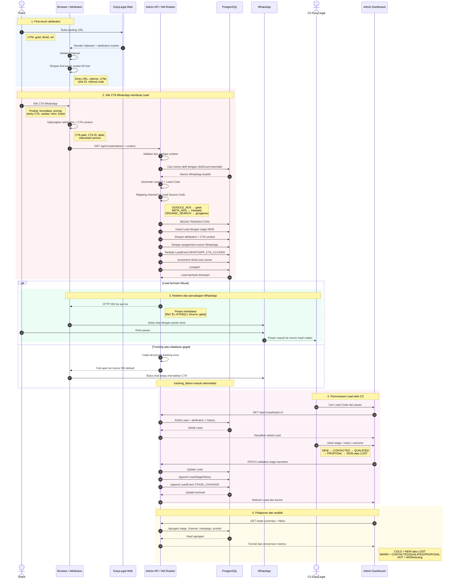
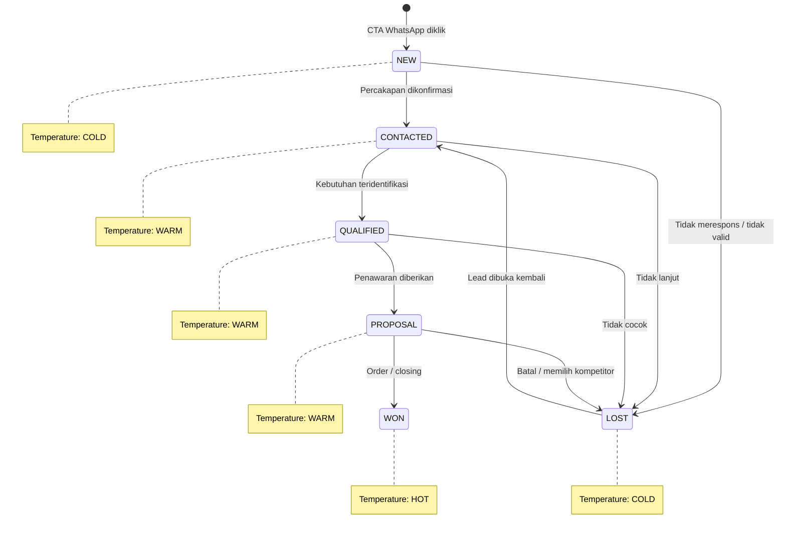

# Sequence Diagram WhatsApp Lead Tracking & Attribution

## Aturan Identitas

- **Lead ID**: identitas internal database.
- **Lead Code**: kode publik per percakapan, misalnya `EL-A7K9Q2`.
- **Lead Source Code**: kode sumber ringkas dalam pesan, misalnya `gads`, `metaads`, atau `googleseo`.
- **Referral Code**: kode partner atau campaign, misalnya `PARTNER-BUDI`.
- Lead Code, Lead Source Code, dan Referral Code tidak boleh dipakai bergantian.

## Mapping Temperature

